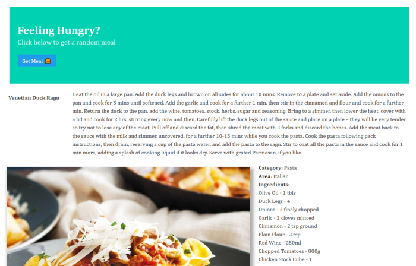

# Random-Meal
Random meals at the push of a button

## Quick Little Project
Just a little side project using the meal db API, as described in a free code camp article
Added a bulma css layout and my own styling, just to play around with APIs
Will experiment later with other search functions available through meal db, and add user input

## Screenshot

